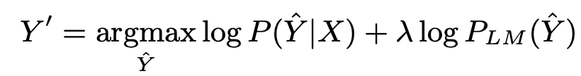
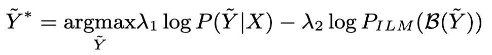
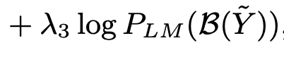
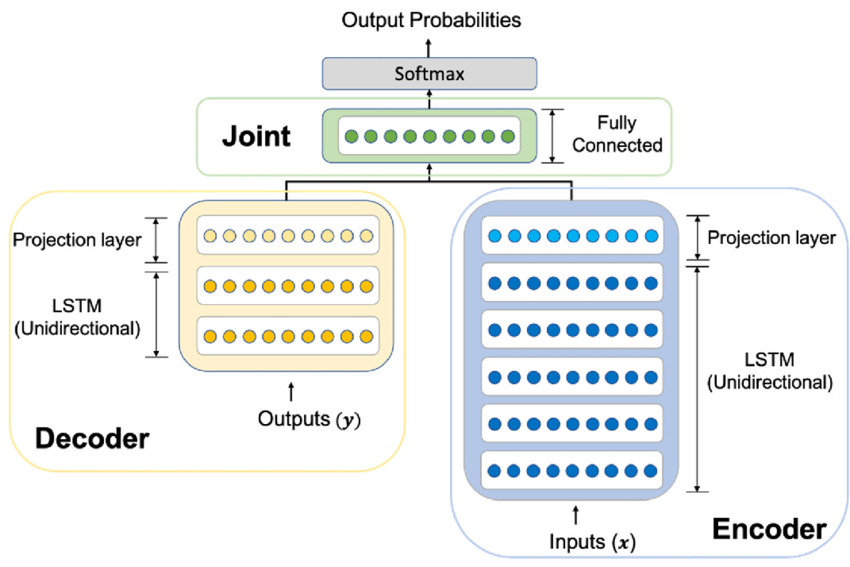
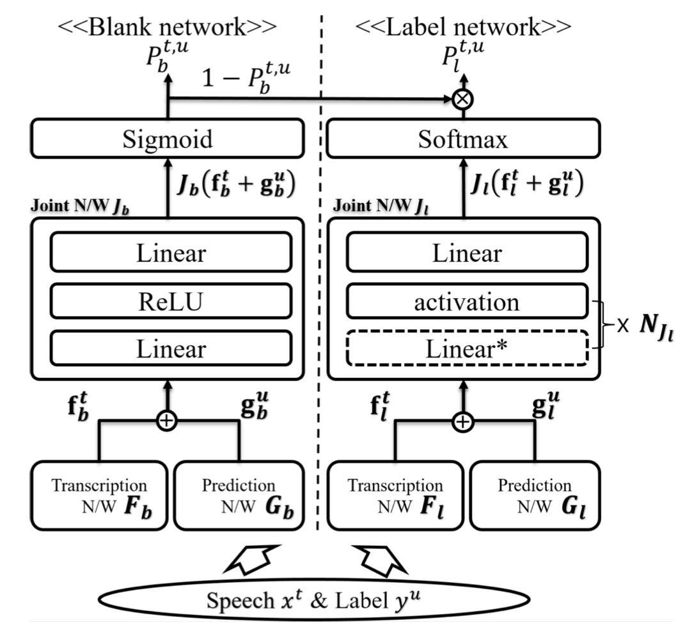
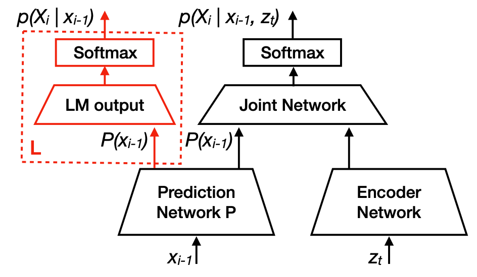
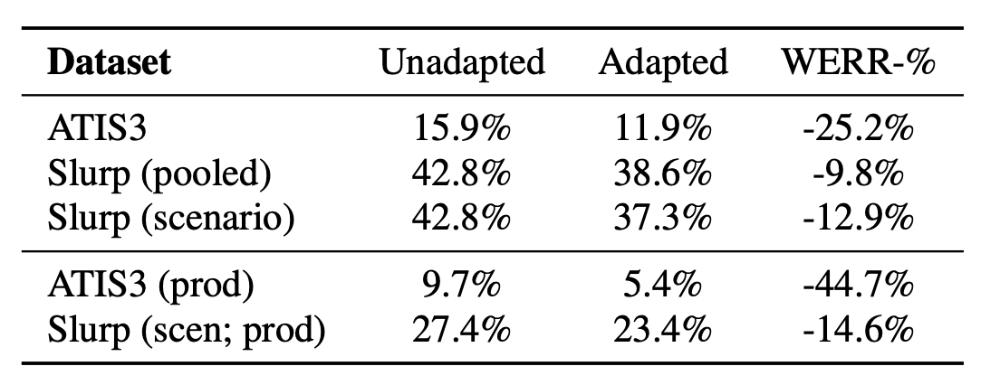
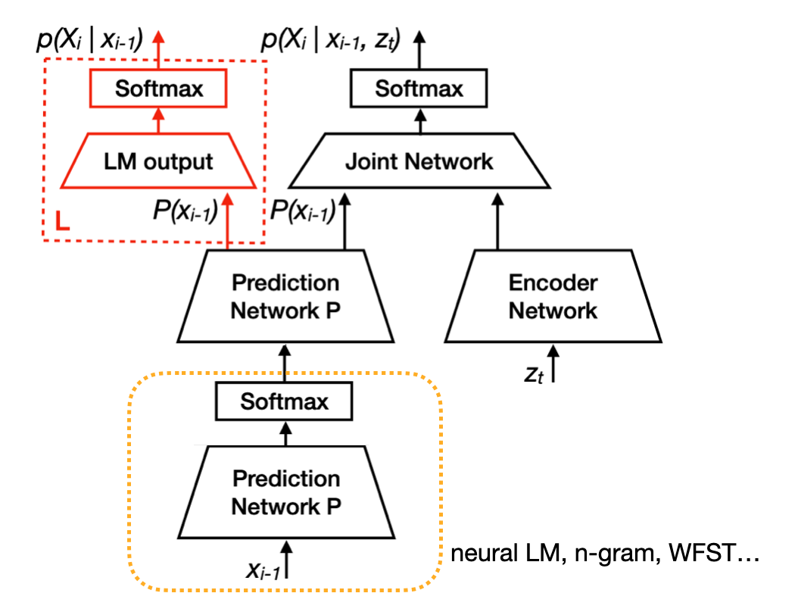
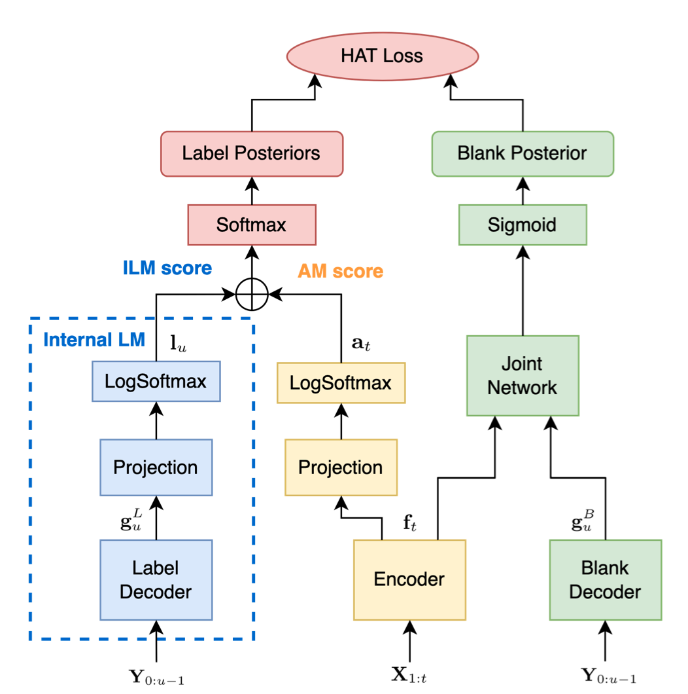

---
# Feel free to add content and custom Front Matter to this file.
# To modify the layout, see https://jekyllrb.com/docs/themes/#overriding-theme-defaults

layout: page
---

<h1 class="post-title">Contextual Biasing (2022)</h1>
 

# Objectives
- We want to improve the accuracy of the Transducer model to a certain domain where we only have text data. (e.g., contact list from your phone)
- We want to do so without extra training on either the Transducer model or an individual language model.

# Previous Work
- Shallow fusion
  - Build a language model (n-gram if extra training is not allowed) and linearly integrate the logprobs for the next token predicted by the speech and the language model.
      
  - An alternative is to estimate the internal langauge model and subtract it from the speech model before adding the external language model. ([HAT](https://arxiv.org/pdf/2003.07705))
       
    - where the internal language model is estimated with Joint(Pred) with the assumption that Joint(Tran + Pred) = Joint(Pred) + Joint(Tran) and that the prediction network holds language information.
       
- Fine-tuning
  - Fine tune the prediction network with the rest of the model frozen. [\[paper\]](https://arxiv.org/abs/2104.11127)
     
  - Fine tune the joint network only.

# Experiments
- What if we can make a detachable language model and feed the output into the Prediction network instead of the previous token?
    
- While the ASR accuracy for the specific domain increased, there were more addition error in the result.
  - Repetitive text tokens occur because the blank token was not predicted properly.
  - The projection layer in the Joint network is capturing the pattern of the Transcription/Prediction vectors when the text token should be yielded.

# Similar Work
- Modular Hybrid Autoregressive Transducer [\[paper\]](https://arxiv.org/pdf/2210.17049)
    
  - The decoder is explicitly divided into "label decoder" and "blank decoder".
  - AM score and ILM score are joined more simply, where as the original Joint network is used for predicting the blank label.

# Inspirations
- The training does not necessarily follow the "design" of the model, and we need to conduct experiments to confirm the meanings of the representations
- What are the ways to explicitly encourage the model to be trained as we designed (model structure, objective functions, etc.)
