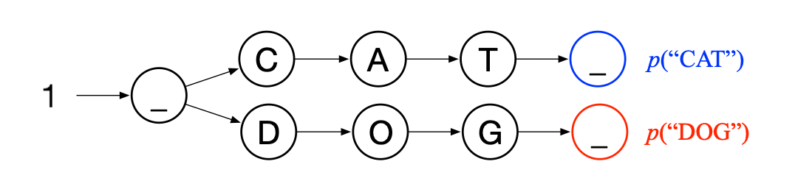
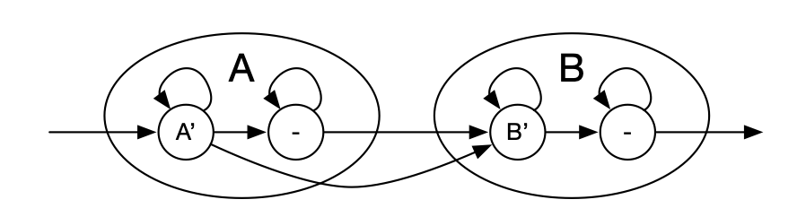
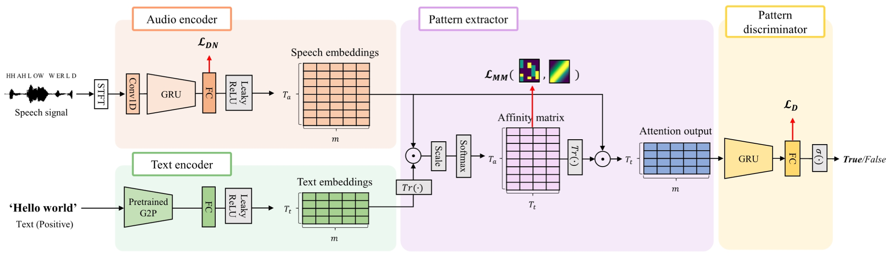
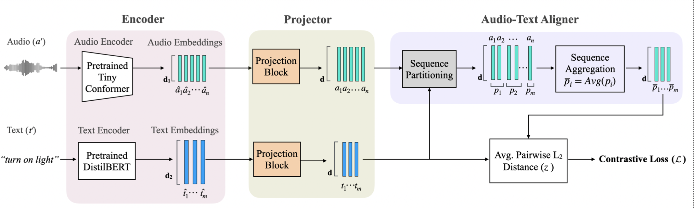
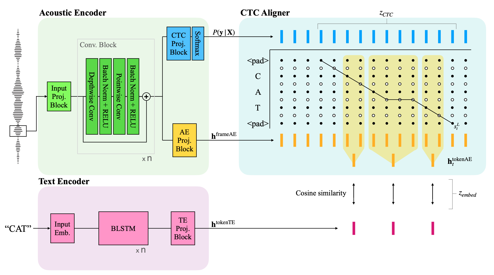
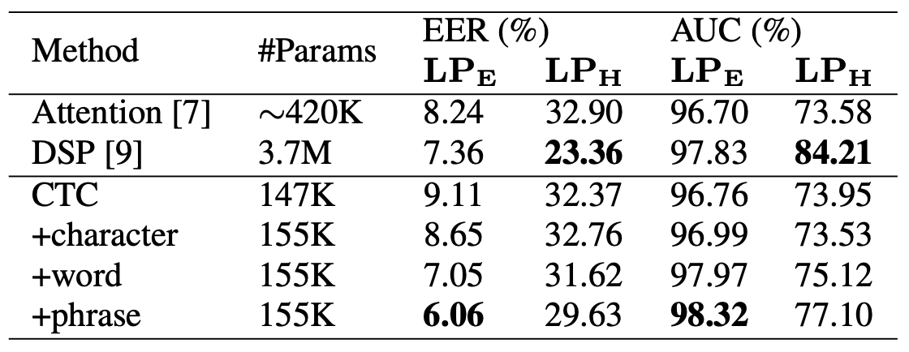
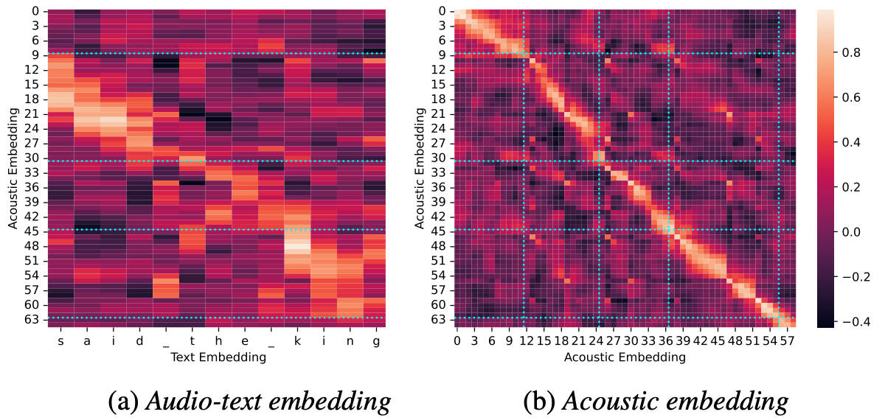
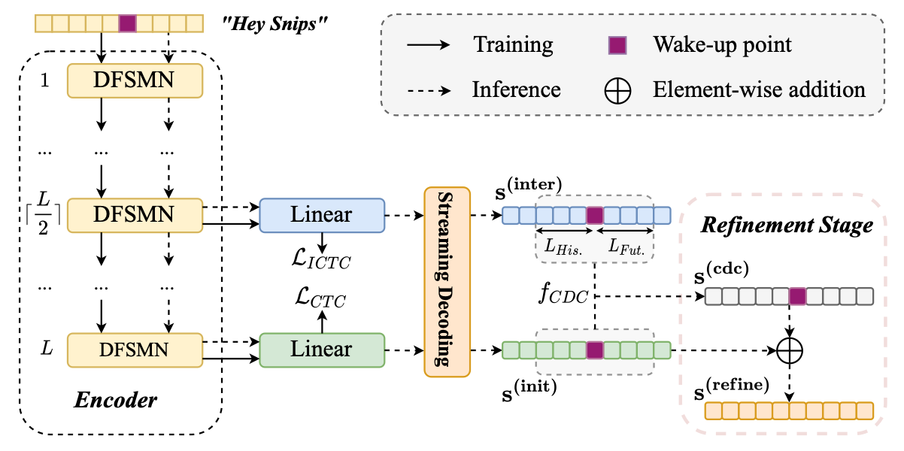
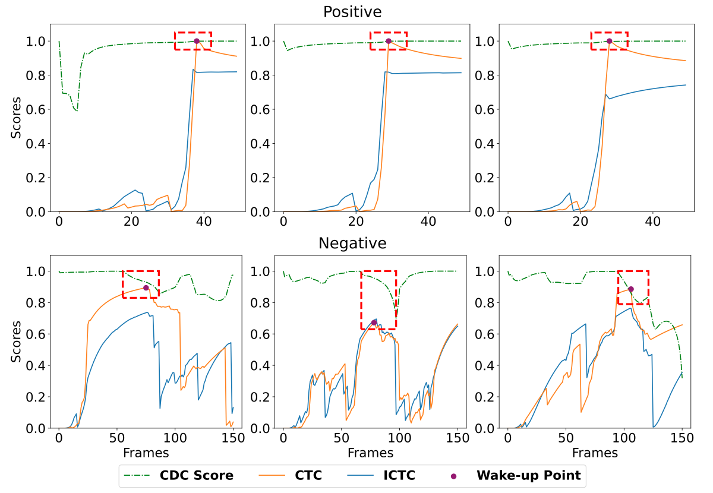

---
# Feel free to add content and custom Front Matter to this file.
# To modify the layout, see https://jekyllrb.com/docs/themes/#overriding-theme-defaults

layout: page
---

<h1 class="post-title">Tiny Spoken Keyword Spotting (2023)</h1>
 

# Objectives
- We needed a tiny model (35k) to run all the time on the device with low computational cost.
- It should be able to detect an arbitrary keyword (enrolled in text form) from an audio stream.

# Previous Work
- ASR-inspired: Streaming CTC keyword spotter [\[paper\]](https://arxiv.org/pdf/1512.08903)
  - A CTC-trained network gives the probability of each tokens in the keyword for every time step.
  - A decoder graph is built with the keyword, where the nodes are the tokens in the keyword and the scores on the edges are set with the logprobs from the CTC model.
       
  - At every frame, each state updates its value by multiplying the net incoming probability by the corresponding CTC output. Among the incoming probabilities, the maximum is chosen to find the best alignment (with timing) instead of the best path (without timing) for streaming use.
  - A keyword is detected when the negative log-posterior probability is below a threshold.
- KWS-inspired: Aligning the acoustic and the text representations
  - Traditional keyword spotting extracts vectors from the keyword and the input audio and compare those to determine the occurrence of the keyword.
  - For open vocabulary, audio-text keyword spotting, the joint representations are learned by aligning the audio and text representations and aggregating the (often) longer audio representations.
    - Attention [\[paper\]](https://arxiv.org/pdf/2206.15400)
        
    - Dynamic Sequence Partitioning [\[paper\]](https://arxiv.org/pdf/2306.05245)
        

# Experiments
- Combined the ASR-inspired and the KWS-inspired methods.
  - CTC and the decoder graph are used for both scoring and the alignment. 
  - The audio representations are aggregated according to the CTC alignment between the audio stream and the text keyword, and the corresponding representations are compared for an embedding score. 
      
  - It enables streaming detection, and compensates the low accuracy of the CTC-only approach with the additional representation matching.
  - The correlation map between the positive examples show the correct alignments. (blue lines)  
       

# Other Works
- Recently, others have solved the problem by using the inconsist results by representations from different layers at false alarm. [\[paper\]](https://arxiv.org/pdf/2412.12635) 
     
- This work again inspires me to look into inner representations. 
