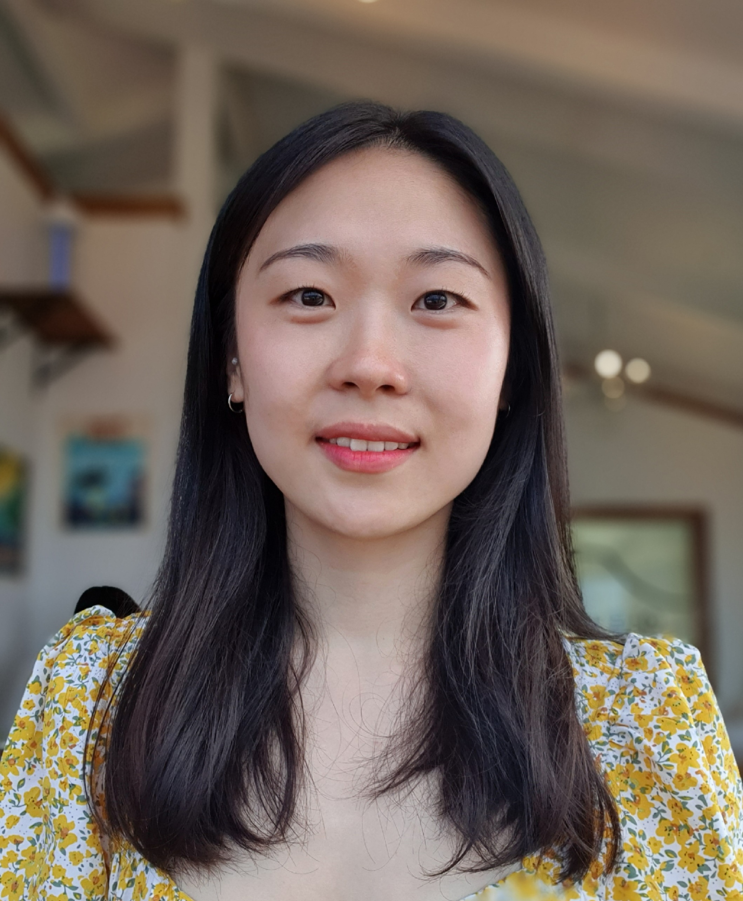

---
# Feel free to add content and custom Front Matter to this file.
# To modify the layout, see https://jekyllrb.com/docs/themes/#overriding-theme-defaults

layout: home
---

I’m a speech researcher at [Samsung Research](https://research.samsung.com), focusing on a broad range of areas within speech recognition and spoken keyword spotting. My work includes:

* Developing [text-audio representation learning](https://arxiv.org/abs/2406.07923) for spoken keyword detection with text-only enrollment using tiny models.
* [Estimating internal language models](https://www.isca-archive.org/interspeech_2023/lee23b_interspeech.html) learned by speech models  to improve inference-time integration with external language models.
* [Full-stack ASR engineering](https://ieeexplore.ieee.org/document/10023291) for [Samsung Bixby](https://www.samsung.com/us/apps/bixby/bixby-user-guide/), including large-scale training, model compression, and inference-time biasing.

In addition to my research in speech processing, I am deeply intrigued by mechanistic interpretability, driven by the inconsistencies I've observed between common beliefs and how models actually function. My curiosity motivates me to address these challenges through representation understanding and causal abstraction.

Prior to Samsung Research, I received B.S. in CSE from Seoul National University.

 

# News!
---
I will be presenting my [paper](https://arxiv.org/abs/2406.07923) on spoken keyword detection at INTERSPEECH 2024!
